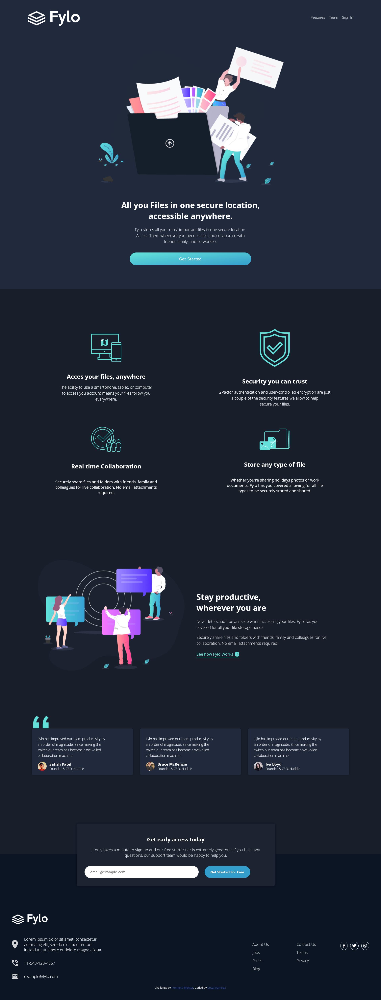

# Frontend Mentor - Fylo dark theme landing page solution

This is a solution to the [Fylo dark theme landing page challenge on Frontend Mentor](https://www.frontendmentor.io/challenges/fylo-dark-theme-landing-page-5ca5f2d21e82137ec91a50fd).

## Table of contents

- [Preview](#Preview)
- [Links](#links)
- [Built with](#built-with)
- [What I learned](#what-i-learned)

### Preview



### Links

- Live Site URL: [Click Me](https://sean365-bit.github.io/Fylo.github.io/)

### Built with

- Semantic HTML5 markup
- CSS custom properties
- Flexbox
- CSS Grid
- Mobile-first workflow
- SCSS
- JavaScript

### What I learned

In this project I learned how to Compile SCSS to CSS, Basically to Compile the SCSS file into a regular CSS file, We need to Navigate to our project directory using the terminal or command prompt and run the following command:

```SCSS

node-sass styles.scss styles.css

```

I as well learned the importance of Media Queries and how they enable us to create styles for specific devices or conditions, making our website adaptable to different screen sizes and devices.

```css
@media media-type and (media-feature) {
  /* CSS rules */
}
```
